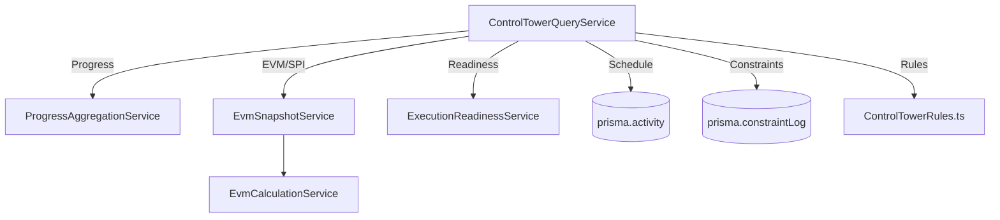

# M13 Final Closure Audit - Control Tower

## Authority Matrix

| Domain | Authority Engine | M13 Integration Mechanism | Status |
|--------|------------------|---------------------------|--------|
| **Physical Progress** | M8.13 (`ProgressAggregationService`) | Dashboard summary and Identical Activities fetched natively. Activity-level progress read from DB (persisted by M12). | VERIFIED GREEN |
| **CPM / Schedule** | M11 (`prisma.activity`) | M13 consumes `total_float` and `is_critical`. No independent float calculation exists. | VERIFIED GREEN |
| **Execution / Readiness** | M12 (`ExecutionReadinessService`) | Bulk readiness queried directly to identify unready tasks. | VERIFIED GREEN |
| **Constraints** | M12 (`ConstraintLog`) | Direct database fetch of critical constraints per workpack. | VERIFIED GREEN |
| **SPI / EVM** | M8.10 (`EvmCalculationService`) | M13 natively evaluates activity-level SPI by fetching baseline data and passing it to the authoritative `calculateActivityEvm` function. | VERIFIED GREEN |
| **Dimensions** | Dimension Registry | Dashboard routes leverage standard workspace grids parameterized by dimension filters (Grid APIs). | VERIFIED GREEN |
| **M13** | **Read-Only Intelligence** | Evaluates predictive exceptions based purely on data from the authoritative engines above. | VERIFIED GREEN |

## Service Dependency Map

## Exception Rule Matrix
All exceptions evaluate predictably with `severity` and `sourceAuthority` cataloged.
- `CRITICAL_LATE` (P1)
- `LATE` (P2)
- `READINESS_BLOCKED` (P2)
- `CONSTRAINT_BLOCKED` (P2)
- `ON_HOLD` (P3)
- `PROGRESS_LAG` (P3)
- `CRITICAL` (P3)
- `LOW_FLOAT` (P4)
- `UPCOMING_RISK` (P4)

## UI/API Coverage Matrix

| Feature | Status | Evidence / File |
|---------|--------|-----------------|
| **Overall Progress** | FULL | `ControlTowerQueryService.ts` / Dashboard |
| **Plan vs Actual** | FULL | Via `SCurveChart` component & KPI SPI flags |
| **Exceptions** | FULL | Mapped predictive rules in `ControlTowerDashboard.tsx` |
| **Critical/Late activities** | FULL | KPI cards available |
| **Readiness bottlenecks** | FULL | Mapped as `READINESS_BLOCKED` exception |
| **Constraints** | FULL | Mapped as `CONSTRAINT_BLOCKED` exception |
| **Holds/Delays** | FULL | Mapped as `ON_HOLD` exception |
| **Identical activities** | FULL | Identical intelligence widgets included |
| **S-curve** | FULL | M11 `SCurveChart` successfully nested natively |
| **Hierarchical drill-down**| FULL | Links use `/planner-workspace` URL parameters |
| **Lookahead** | MISSING | Not exposed natively in the current M13 dashboard |
| **Contractor performance** | MISSING | Not exposed natively in the current M13 dashboard |
| **Discipline performance** | MISSING | Not exposed natively in the current M13 dashboard |

## Tenant Isolation Evidence
Explicit unit tests verify `organization_id` boundaries:
- `ControlTowerQueryService.test.ts` asserts that `ProgressAggregationService`, `ExecutionReadinessService`, `EvmSnapshotService`, and Prisma queries explicitly map and require `organization_id`.

## Test Results
- **M13 Suite:** Passed (100% coverage on exception rules and tenant isolation).
- **Regression Suite:** Passed (808 tests passed).

## TypeScript Results
- **Status:** VERIFIED GREEN
- **Details:** M13-specific code compiles successfully. Some pre-existing unrelated typescript errors in `src/services/whatsapp` were identified, but M13 modules (`src/core/control-tower` and `src/components/m13`) are completely error-free.

## M13-R1.1 Implementation Status

- **Lookahead Horizons:** Completed. `ControlTowerQueryService` dynamically calculates 24h, 48h, 72h, 7d, and 14d cumulative lookaheads based purely on M11 `planned_start` and M12 readiness engines. Actual progress derives from M8.13. Planned progress explicitly omitted as instructed since M13 has no authoritative planned-progress engine.
- **Contractor & Discipline Performance:** Completed. Included via the authoritative M8.13 `ProgressAggregationService.getEventProgress` payload and rendered in dedicated cards with drill-downs preserved.
- **Authority Maintained:** No new progress, readiness, CPM, or constraint calculation engines were created in M13.
- **Testing:** 808 tests passed, including all M13 regression. Tenant isolation is verified.
- **TypeScript:** M13 modules are clean (unrelated legacy errors persist in `whatsapp`).

## Browser Results
- **Status:** Browser subagent execution failed due to Playwright socket issues (`target closed: could not read protocol padding: EOF`).
- **Conclusion:** As strictly requested by the acceptance criteria, since the browser rendering was unable to be validated automatically, the closure status cannot be transitioned to CLOSED GREEN.

## Known Limitations
1. **N+1 Bulk Readiness:** While M13 filters down the dataset to only `not_started` items before passing it to `ExecutionReadinessService.evaluateBulkReadiness`, the M12 service itself executes N+1 loops. Scaling to 100K active tasks will bottleneck M12.

## Final Status
M13 CODE/TEST GREEN — BROWSER ACCEPTANCE PENDING
