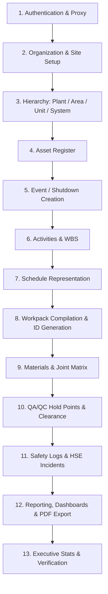
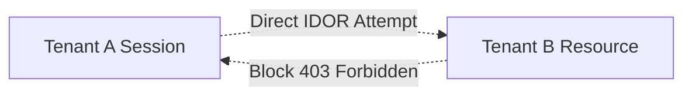

# M7.9.4 — Baseline Regression Checklist

This checklist defines the mandatory end-to-end regression path required for all subsequent product releases and milestones.

---

## 1. Core Shutdown Management Lifecycle Regression

### Verification Checklist
- [ ] **1. Authentication:** Platform Admin login (`/api/auth/callback/credentials`) and Proxy session entry (`/api/proxy/enter`).
- [ ] **2. Site Setup:** Site creation, listing, metadata mutation, and duplicate code rejection (`/api/hierarchy/sites`).
- [ ] **3. Plant / Area / Unit / System:** Multi-tier tree node hierarchy creation and retrieval (`/api/hierarchy`).
- [ ] **4. Asset Register:** Asset onboarding, tagging, and specification assignment (`/api/hierarchy/assets`).
- [ ] **5. Event:** Shutdown event setup with planned dates and target site assignment (`/api/events`).
- [ ] **6. Activities:** Multi-discipline activities (Mech, Elec, Inst, Piping, General) creation (`/api/activities`).
- [ ] **7. Schedule:** Schedule generation and critical path mapping (`/api/schedule`).
- [ ] **8. Workpack:** Atomic sequential ID generation (`U10-MEC-001`), status updates (`/api/workpacks`).
- [ ] **9. Materials:** Line list query and bolt/gasket lookup matrix verification (`/api/line-lists`).
- [ ] **10. QA/QC:** Hold point marking, activity association, and inspection clearance (`/api/workpacks/[id]/hold-points`).
- [ ] **11. Safety:** Daily HSE metrics logging and Near Miss incident reporting (`/api/events/[id]/safety`).
- [ ] **12. Reporting:** Dashboard dataset compilation, certificate templates, and PDF compilation (`/api/workpacks/[id]/pdf`).
- [ ] **13. Dashboard:** Real-time metrics calculations (`/api/dashboard/stats`).

---

## 2. Multi-Tenant Isolation & Security Regression

- [ ] **Tenant Provisioning:** Automatic provisioning of new tenant organization, site, roles, units, and admin user (`/api/admin/tenants/provision`).
- [ ] **Isolation Check:** Tenant B cannot view or list Tenant A's sites, hierarchy, events, or workpacks.
- [ ] **IDOR Protection:** Direct URL access across tenant boundaries returns **403 Forbidden**.
- [ ] **Platform Barrier:** Non-platform tenant admins cannot invoke platform admin APIs.

---

## 3. RBAC & Access Control Regression

- [ ] **Admin Roles:** Full read/write access to tenant configuration and operational modules.
- [ ] **Planner / Engineer Roles:** Access to planning, schedule, and workpack modules; restricted from platform administration.
- [ ] **Safety Officer:** Access to HSE logs and incident creation; restricted from organizational configuration.
