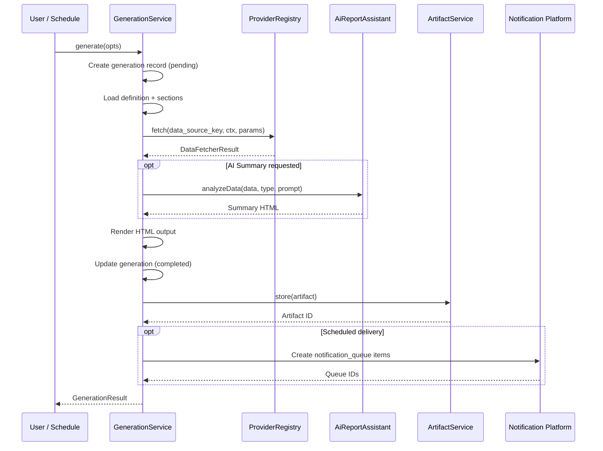

# M7.6B — Report Execution Lifecycle

## Overview

Every report generation follows an immutable lifecycle from request to delivery.

## Lifecycle Stages

```
1. Request     → Generation record created (status: pending)
2. Generating  → Data fetched, sections rendered (status: generating)
3. Completed   → HTML/output produced, artifact stored (status: completed)
4. Delivery    → Notification platform enqueues emails (status: completed)
5. Archived    → Artifact retained per retention policy
```

## Sequence Diagram



## Immutability

Execution records (`report_generations`) are **immutable** after completion:
- `status` transitions: `pending → generating → completed | failed`
- No update on completed records
- Each generation gets a unique ID
- Artifacts are linked to generations

## Retry Logic

When a generation fails:
1. `retry_count` is incremented
2. `error_message` is recorded
3. Schedule updates `last_error`
4. Retries up to 3 times with exponential backoff

## Artifact Retention

- Default retention: **90 days**
- Configurable per artifact
- `ArtifactService.cleanupExpired()` removes expired artifacts
- Archived artifacts are excluded from automatic cleanup

## Delivery Tracking

Each generation tracks:
- `notification_id` — the notification queue item
- `smtp_message_id` — SMTP message ID for delivery verification
- `notification_queue_ids` — all queued notification IDs

## Dashboard Metrics

The Execution Dashboard provides real-time visibility:
- Reports generated (today / week / month)
- Average generation duration
- Failure rate and alerts
- Pending queue depth
- Most-used reports (last 30 days)
- Most-active schedules
