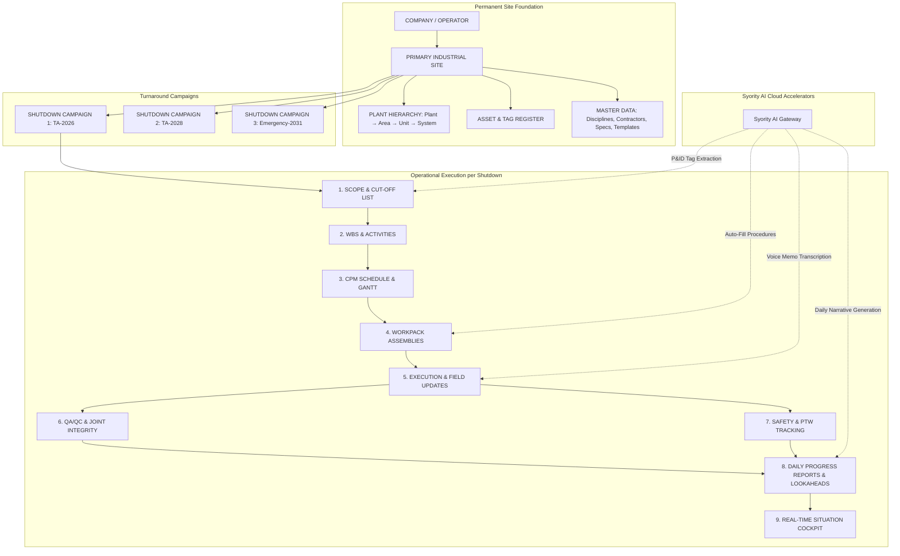

# M8.0 — Target Product Model: SYORITY Shutdown OS

This document outlines the core architecture and conceptual product model for SYORITY as a dedicated industrial Shutdown & Turnaround Management System.

---

## 1. Conceptual Data & Operational Hierarchy

The product model is organized around a **Single Site / Multi-Shutdown Architecture**, allowing industrial plants and turnaround contractors to maintain a permanent site asset registry while running multiple independent turnaround campaigns over years.



---

## 2. Structural Layer Analysis

### Layer 1: Permanent Site & Asset Foundation (Shared Across All Shutdowns)
*   **Company & Site:** Defines the operating entity and physical location (e.g., *Refinery Complex A*).
*   **Hierarchy Nodes:** Persistent structure (Plants, Areas, Process Units, Systems) mapped once and reused indefinitely.
*   **Asset & Equipment Register:** Master tags (`P-1001`, `E-102`, `V-101`), design pressures, operating temperatures, and metallurgy.
*   **Master Standards:** Standard ASME/PCC-1 flange torque tables, gasket spec lookup matrices, certificate templates, and approved contractor directories.

### Layer 2: Independent Shutdown Campaigns (Isolated per Event)
Each shutdown (e.g., `TA-2026`, `TA-2028`, `Pitstop-2029`) represents an isolated execution window with its own:
*   **Target Dates:** Planned start/end dates, freeze dates, mechanical completion target, startup readiness.
*   **Budget & Manhours:** Planned manhour allocations, contractor headcounts, cost budgets.
*   **Scope Inclusions / Exclusions:** List of approved overhaul jobs, work orders, and capital additions.
*   **WBS & Activities:** Detailed task breakdowns with duration estimates, logic ties, and contractor assignments.
*   **Schedule & Critical Path:** Dynamic Gantt chart with early/late dates and float calculations.
*   **Workpack Assemblies:** Compiled job folders with sequential identifiers (`U10-MEC-001`), drawings, material lists, and hold points.
*   **Shift Progress & Actuals:** Percentage completions, actual start/finish timestamps, manhour burn logs, and constraint logs.
*   **QA/QC & Flange Joint Registers:** Specific joint break/make records, inspection sign-offs, and torque verification.
*   **Safety Metrics:** Daily PTW permit counts, toolbox talks, and incident reports.
*   **Reports & Cockpit:** 24h/72h lookahead summaries, shift handover sheets, and dashboard analytics.

---

## 3. Syority AI Cloud Boundary

SYORITY adopts a clean separation between **Deterministic Core Software** (running 100% locally and offline-capable) and **Syority AI Accelerators** (cloud-assisted productivity tools).

```
┌──────────────────────────────────────────────────────────────────┐
│                   LOCAL-FIRST DETERMINISTIC CORE                 │
│  • Database (PostgreSQL)  • Schedule Math (CPM / Float)          │
│  • Workpack IDs & Revision Control                               │
│  • Joint Torque & Gasket Lookups                                 │
│  • QA/QC Clearance Sign-offs                                     │
│  • Safety Manhours & Incident Logs                               │
│  • PDF Export & Print Engine                                     │
└──────────────────────────────────────────────────────────────────┘
                                ▲
                                │ HTTPS (Metered API Token Key)
                                ▼
┌──────────────────────────────────────────────────────────────────┐
│                   SYORITY AI CLOUD ACCELERATORS                  │
│  • Workpack Procedure & Tool Auto-Fill Generator                 │
│  • Multimodal P&ID Drawing OCR & Tag Extractor                   │
│  • Field Audio Memo Speech-to-Shift Progress Transcriber         │
│  • Executive Daily Shutdown Narrative Drafter                    │
│  • Natural Language Query & Knowledge Assistant                  │
└──────────────────────────────────────────────────────────────────┘
```

### Deterministic Integrity Guarantees
1.  **Zero Hallucinations in Calculations:** Scheduling dates, float values, torque ratings, and safety manhours are strictly computed by deterministic TypeScript math engines and stored in PostgreSQL.
2.  **Uninterrupted Offline Operation:** If internet access is unavailable on an offshore platform, remote plant, or secure intranet, all planning, scheduling, workpack printing, QA sign-offs, and reporting operations continue with zero degradation.
3.  **Chargeable Cloud Token Boundary:** When an engineer clicks an AI button (e.g., *"Auto-Generate Activity Steps"* or *"Extract P&ID"*), the request is dispatched to the Syority Cloud AI Gateway with the organization's prepaid AI token key. Token consumption is metered per call, and unused balances carry forward across future shutdowns.
