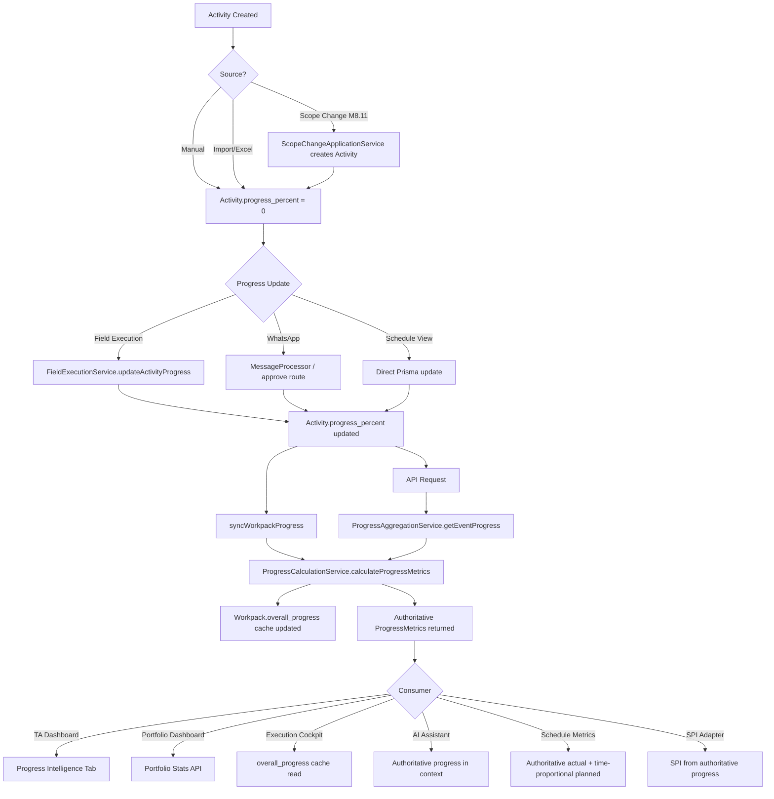
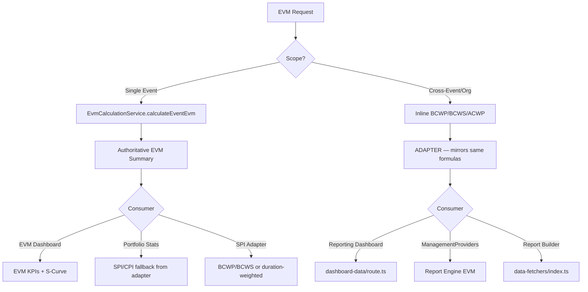
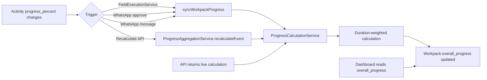

# M8.13 Phase 3 — Logic Flow Audit

> **Module**: M8.13 — Enterprise Progress Intelligence
> **Date**: 2026-09-01
> **Phase**: 3 — Enterprise Progress Governance

---

## Activity Lifecycle Progress Flow (AFTER Phase 3)



---

## EVM Data Flow (AFTER Phase 3)



---

## Scope Change Impact (M8.11 — READ-ONLY verification)

```
BEFORE Scope Change:
  Activities A,B = 1000hrs total → ProgressCalculationService → 60%

ScopeChangeApplicationService.applyApprovedChanges()
  → Creates new Activity C (200hrs, 0%)

AFTER Scope Change:
  Activities A,B,C = 1200hrs total → ProgressCalculationService → 50%

Key: The authoritative service uses findMany with deleted_at: null, status ≠ cancelled.
     New scope activities automatically participate in the denominator.
     No modification to ScopeChangeApplicationService was needed.
```

---

## Material Readiness (M8.12 — READ-ONLY verification)

```
Material Readiness Score = percentage of required materials that are available
Execution Progress = duration-weighted activity completion

These are SEPARATE metrics. Material readiness is a CONSTRAINT dimension,
NOT execution progress.

Material readiness DOES NOT feed into ProgressCalculationService.
Material status may block activities from starting, but the progress
calculation only reads activity.progress_percent, not material status.
```

---

## Scenario Projection (M8.9 — READ-ONLY verification)

```
Scenario Mode:
  EvmScenarioProjection creates WHAT-IF projections
  These projections DO NOT modify live activity.progress_percent
  Scenario progress is READ-ONLY PROJECTION

Live Mode:
  ProgressCalculationService reads live activity records
  EvmCalculationService reads live activity records

No cross-contamination between live and scenario progress.
```

---

## Cache Synchronization Flow



---

## Before/After Comparison

| Site | BEFORE Phase 3 | AFTER Phase 3 |
|------|----------------|---------------|
| WhatsApp MessageProcessor | Simple avg → overall_progress | **syncWorkpackProgress → authoritative** |
| WhatsApp approve route | Simple avg → overall_progress | **syncWorkpackProgress → authoritative** |
| schedule/metrics/route | Inline duration-weighted | **ProgressCalculationService → authoritative** |
| AI assistant | `_avg.progress_percent` (Prisma avg) | **ProgressCalculationService → authoritative** |
| dashboard-data/route | Inline BCWP/BCWS | **Documented as ADAPTER** |
| ManagementProviders | Inline `computeEvm()` | **Documented as ADAPTER** |
| report-builder fetchers | Duplicate `computeEvm()` | **Documented as ADAPTER** |
| ScheduleContainer | Simple avg tooltip | **Documented as PRESENTATION-ONLY** |
| WbsView | Simple avg rollup | **Documented as PRESENTATION-ONLY** |
| WorkpackSummaryBar | Cached overall_progress | **Documented as PRESENTATION-ONLY** |
| ScheduleHealthService | Duration-weighted SPI | **Protected M8.8 — documented as ADAPTER** |
| SchedulingService S-curve | Duration-weighted actual | **Documented as PRESENTATION-ONLY** |
