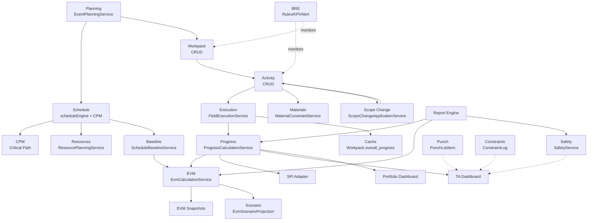

# M8.14 — Cross-Module Audit

> **Module**: M8.14 | **Date**: 2026-09-01 | **Type**: READ-ONLY

---

## Module Dependency Graph

---

## Authority Matrix

| Data Element | Authoritative Module | Authoritative Service | Consumers |
|-------------|---------------------|----------------------|-----------|
| Activity progress_percent | Execution | FieldExecutionService | Progress, EVM, Schedule, Reports |
| Weighted progress | Progress | ProgressCalculationService | TA Dashboard, Portfolio, Reports, AI |
| Workpack overall_progress | Progress (cache) | syncWorkpackProgress | Execution Cockpit, Portfolio |
| EVM (BCWP/BCWS/ACWP) | EVM | EvmCalculationService | EVM Dashboard, Reports |
| SPI (duration-based) | Progress | SpiAdapter | TA Dashboard, Portfolio |
| SPI (cost-based) | EVM | EvmCalculationService | EVM Dashboard |
| Critical path | Schedule | scheduleEngine | Schedule View, Reports |
| Material readiness | Materials | MaterialReadinessService | Materials page, TA Dashboard |
| Resource loading | Resources | ResourcePlanningService | Resource views, TA Dashboard |
| Safety KPIs | Safety | SafetyService | Safety page, TA Dashboard |
| Scope changes | Scope Change | ScopeChangeApplicationService | Scope page, TA Dashboard |
| Schedule health | Schedule | ScheduleHealthService | Planner workspace |
| Constraints | — (CRUD) | Direct Prisma | Constraint page, TA Dashboard |
| Punch items | — (CRUD) | Direct Prisma | Punch page, TA Dashboard |

---

## Data Propagation Audit

| Source Change | Expected Propagation | Verified |
|--------------|---------------------|----------|
| Activity.progress_percent → | Workpack.overall_progress cache | ✅ Via syncWorkpackProgress |
| Activity created (scope change) → | Progress denominator increases | ✅ Tested (M8.13 test #27) |
| Activity cancelled → | Excluded from progress | ✅ Tested (M8.13 test #28) |
| Baseline created → | EVM BCWS available | ✅ Via EvmCalculationService |
| Activity dates changed → | CPM not auto-recalculated | ⚠️ Manual trigger needed |
| Material constraint added → | Readiness recalculated | ✅ Via MaterialReadinessService |
| Resource assigned → | Resource histogram updated | ✅ Via ResourcePlanningService |
| Safety log added → | TA Dashboard reflects | ✅ Via API fetch |

---

## Integration Issues

| # | Severity | Issue | Modules |
|---|----------|-------|---------|
| X1 | 🔴 HIGH | Activity update in schedule view bypasses FieldExecutionService | Schedule → Progress |
| X2 | 🟡 MEDIUM | No CPM auto-recalculation on date changes | Schedule → CPM |
| X3 | 🟡 MEDIUM | Scenario calculations isolated but no clear UI separation | EVM → Scenario |
| X4 | 🟡 MEDIUM | Discovery work minimal integration with scope change | Discovery → Scope |
| X5 | 🟢 LOW | Shift reports not linked to activity progress | Shift → Execution |
| X6 | 🟡 MEDIUM | No quality KPI integration | Quality → TA Dashboard |
| X7 | 🟢 LOW | Engineering issues not linked to workpack/activity | Issues → Planning |
