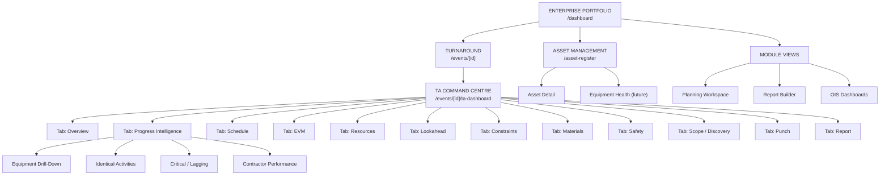

# M8.14 — Dashboard Architecture Audit

> **Module**: M8.14 | **Date**: 2026-09-01 | **Type**: READ-ONLY

---

## Current Dashboard Hierarchy

```
ENTERPRISE / PORTFOLIO
├── /dashboard                    → PortfolioDashboard (summary cards + quick actions)
│   └── Portfolio stats API       → avg progress, SPI, counts
│
├── TURNAROUND EVENTS
│   ├── /events                   → Event list
│   ├── /events/[id]              → Event detail
│   ├── /events/[id]/ta-dashboard → TA Command Centre (DUPLICATE PATH 1)
│   ├── /projects/[id]/ta-dashboard → TA Command Centre (DUPLICATE PATH 2)
│   ├── /events/[id]/scope        → Scope Change
│   ├── /events/[id]/materials    → Materials
│   ├── /events/[id]/safety       → Safety
│   ├── /events/[id]/wbs          → WBS View
│   └── /events/[id]/execution-readiness → Readiness
│
├── PROJECT VIEWS (mirror event views)
│   ├── /projects/[id]            → Project detail
│   ├── /projects/[id]/schedule   → Gantt/Schedule
│   ├── /projects/[id]/workpacks  → Workpack list
│   ├── /projects/[id]/equipment  → Equipment
│   ├── /projects/[id]/constraints → Constraints
│   ├── /projects/[id]/punch      → Punch list
│   ├── /projects/[id]/safety     → Safety
│   ├── /projects/[id]/reports    → Reports
│   └── /projects/[id]/lookahead  → Lookahead
│
├── MODULE DASHBOARDS
│   ├── /execution                → Execution Cockpit
│   ├── /execution/lookahead      → Lookahead
│   ├── /execution/plan-vs-actual → Plan vs Actual
│   ├── /safety                   → Safety module (org-wide)
│   ├── /schedule                 → Schedule (org-wide)
│   ├── /constraints              → Constraint dashboard
│   ├── /punch                    → Punch dashboard
│   ├── /reporting                → Reporting dashboard
│   └── /shift-reports            → Shift reports
│
├── INTELLIGENCE
│   ├── /workpack-intelligence    → WP Intelligence
│   ├── /planner-workspace        → Planner workspace
│   ├── /ois/*                    → OIS dashboards
│   └── /report-builder/*        → Report builder
│
├── ASSET / PLANT
│   ├── /asset-register           → Asset register
│   ├── /digital-plant            → Digital plant
│   └── /engineering-issues       → Engineering issues
│
└── PLANNING
    ├── /planning/activities      → Activities
    ├── /planning/systems         → Systems
    ├── /planning/units           → Units
    ├── /planning/templates       → Templates
    ├── /planning/blinds          → Blinds
    ├── /planning/joints          → Joints
    └── /shutdown-scope           → Shutdown scope
```

---

## Dashboard Consolidation Analysis

### 🔴 Critical Issues

| # | Issue | Current State | Recommendation |
|---|-------|---------------|----------------|
| DA1 | **Duplicate TA Dashboard paths** | `/events/[id]/ta-dashboard` AND `/projects/[id]/ta-dashboard` | Consolidate to single route |
| DA2 | **No unified command centre** | 31+ pages, no clear hierarchy | Create TA Command Centre as single entry point |
| DA3 | **Org-wide vs event-scoped overlap** | `/safety` (org) + `/events/[id]/safety` (event) + `/projects/[id]/safety` (project) | Unify with context switcher |
| DA4 | **Projects/Events confusion** | Both `/projects/[id]/*` and `/events/[id]/*` exist | Consolidate — Event IS the project in TA context |

### 🟡 Medium Issues

| # | Issue | Impact |
|---|-------|--------|
| DA5 | Portfolio Dashboard has no progress ring | Main dashboard shows counts only, not progress |
| DA6 | Execution Cockpit disconnected from TA Dashboard | Two separate execution views |
| DA7 | No equipment-centric dashboard | Asset data exists but no dashboard for equipment health |
| DA8 | Report Builder separate from reporting | Fragmented reporting experience |

---

## Recommended Enterprise Dashboard Hierarchy



### Design Principles
1. **TA Command Centre** is the primary operational dashboard (current `ta-dashboard`)
2. **Tabs, not pages** — each module is a tab within the command centre
3. **Portfolio → Event → Equipment → Activity** drill-down hierarchy
4. **Context-aware** — filter by event, unit, equipment type, contractor
5. **No orphan dashboards** — every view reachable from portfolio or command centre

---

## What Management Needs to Answer (vs Current State)

| Question | Current Coverage | Gap |
|----------|-----------------|-----|
| What is the current TA status? | ✅ TA Dashboard Overview | — |
| What is complete? | ✅ Progress Intelligence | — |
| What is balance? | ✅ Balance duration shown | — |
| What is late? | 🟡 Overdue workpacks shown | Missing: late activities detail |
| What will delay completion? | 🟡 Constraints shown | Missing: critical path impact |
| Why is it delayed? | ❌ Not available | Need: delay cause analysis |
| Which equipment is at risk? | ✅ Equipment drill-down | — |
| Which activities are lagging? | ✅ Critical/Lagging section | — |
| Which materials are blocking? | 🟡 Materials tab | Missing: material → activity impact |
| Which contractor underperforms? | 🟡 Contractor dimension | Missing: performance metrics |
| What has changed? | ❌ Not available | Need: daily change log |
| What decision is required? | ❌ Not available | Need: decision queue |
