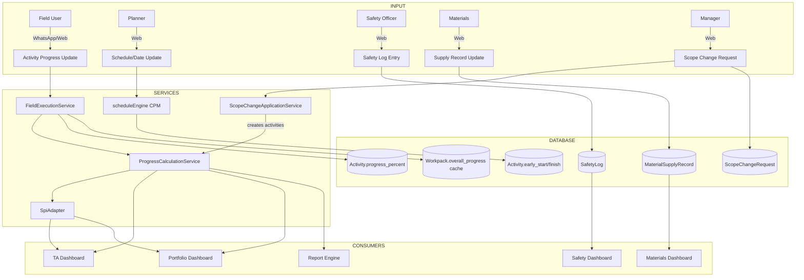

# M8.14 — Data and Logic Flow Map

> **Module**: M8.14 | **Date**: 2026-09-01 | **Type**: READ-ONLY

---

## Master Data Flow



## Logic Flow: Progress Calculation

```
Input: Activity[] (from Prisma findMany)
  │
  ├─ Filter: deleted_at IS NULL, status ≠ cancelled
  │
  ├─ For each activity:
  │   ├─ duration = activity.duration_hours ?? 0
  │   ├─ progress = clamp(activity.progress_percent ?? 0, 0, 100)
  │   └─ earned = duration × (progress / 100)
  │
  ├─ Aggregate:
  │   ├─ totalDuration = Σ(duration)
  │   ├─ completedDuration = Σ(earned)
  │   ├─ balanceDuration = totalDuration - completedDuration
  │   └─ weightedProgress = totalDuration > 0 ? round(completedDuration / totalDuration × 100) : 0
  │
  └─ Output: ProgressMetrics {
       weightedProgress, totalDurationHours, completedDurationHours,
       balanceDurationHours, totalActivities, completedActivities,
       inProgressActivities, notStartedActivities
     }
```

## Logic Flow: EVM Calculation

```
Input: Activity[] + BaselineActivity[] + Event
  │
  ├─ BCWS (PV):
  │   └─ Σ(baseline.budgeted_cost × time_proportion_to_status_date)
  │
  ├─ BCWP (EV):
  │   └─ Σ(activity.budgeted_cost × activity.progress_percent / 100)
  │
  ├─ ACWP (AC):
  │   └─ Σ(activity.actual_cost)
  │
  ├─ Derived:
  │   ├─ SPI = BCWP / BCWS
  │   ├─ CPI = BCWP / ACWP
  │   ├─ CV = BCWP - ACWP
  │   ├─ SV = BCWP - BCWS
  │   ├─ EAC = BAC / CPI
  │   ├─ ETC = EAC - ACWP
  │   └─ VAC = BAC - EAC
  │
  └─ Output: EvmSummary
```
