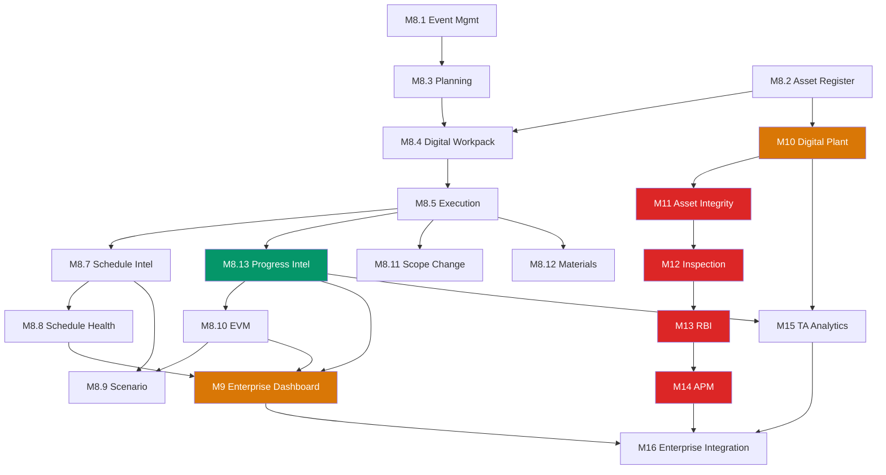

# M8.14 — Dependency Map

```mermaid
flowchart TD
    M8.1[M8.1 Event Mgmt] --> M8.3[M8.3 Planning]
    M8.2[M8.2 Asset Register] --> M8.4[M8.4 Digital Workpack]
    M8.3 --> M8.4
    M8.4 --> M8.5[M8.5 Execution]
    M8.5 --> M8.7[M8.7 Schedule Intel]
    M8.5 --> M8.13[M8.13 Progress Intel]
    M8.7 --> M8.8[M8.8 Schedule Health]
    M8.7 --> M8.9[M8.9 Scenario]
    M8.13 --> M8.10[M8.10 EVM]
    M8.10 --> M8.9
    M8.5 --> M8.11[M8.11 Scope Change]
    M8.5 --> M8.12[M8.12 Materials]
    
    M8.13 --> M9[M9 Enterprise Dashboard]
    M8.10 --> M9
    M8.8 --> M9
    
    M8.2 --> M10[M10 Digital Plant]
    M10 --> M11[M11 Asset Integrity]
    M11 --> M12[M12 Inspection]
    M12 --> M13[M13 RBI]
    M13 --> M14[M14 APM]
    M10 --> M15[M15 TA Analytics]
    M8.13 --> M15
    
    M9 --> M16[M16 Enterprise Integration]
    M14 --> M16
    M15 --> M16
    
    style M8.13 fill:#059669,color:white
    style M9 fill:#d97706,color:white
    style M10 fill:#d97706,color:white
    style M11 fill:#dc2626,color:white
    style M12 fill:#dc2626,color:white
    style M13 fill:#dc2626,color:white
    style M14 fill:#dc2626,color:white
```

**Legend**: 🟢 Green = Certified | 🟡 Orange = Ready/Partial | 🔴 Red = Not Started
